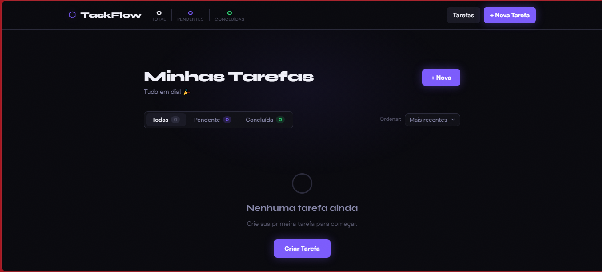

<h1 align="center">TaskFlow</h1>

<p align="center">
  Aplicação moderna de gerenciamento de tarefas desenvolvida com React.
</p>

<p align="center">
  
  
  
  
</p>

---

# 📋 Sobre o Projeto

TaskFlow é uma aplicação moderna de gerenciamento de tarefas desenvolvida com React, Context API e React Router DOM como parte do **Projeto de Certificação da Trilha React — DEVstart**.

A aplicação foi criada com foco na prática de conceitos fundamentais e avançados do ecossistema React, simulando o funcionamento de aplicações reais de produtividade e gerenciamento de tarefas.

O projeto permite criar, visualizar, editar, concluir e excluir tarefas de forma dinâmica, utilizando gerenciamento global de estado com Context API, navegação entre páginas com React Router DOM e persistência de dados via `localStorage`.

Além das funcionalidades CRUD completas, o TaskFlow também prioriza:

- Interface moderna e responsiva
- Componentização reutilizável
- Organização escalável de código
- Experiência do usuário
- Persistência entre sessões
- Estrutura baseada em boas práticas de Front-End moderno

---

# ✨ Funcionalidades

- ✅ **Criar** tarefas com título, descrição, prioridade e categoria
- 📋 **Listar** tarefas com filtros:
  - Todas
  - Pendentes
  - Concluídas
- ↕️ **Ordenar** tarefas:
  - Mais recentes
  - Prioridade
  - Ordem alfabética
- ✏️ **Editar** tarefas existentes
- 🗑️ **Excluir** tarefas com animação de saída
- ☑️ **Marcar como concluída** diretamente na lista
- 💾 **Persistência de dados** com `localStorage`
- 📱 **Interface responsiva** para desktop e mobile
- 🎨 **UI moderna** com tema dark/neon e animações suaves

---

# 🛠️ Tecnologias Utilizadas

- **React 18**
- **React Router DOM v6**
- **Context API**
- **JavaScript**
- **CSS3**
- **localStorage**
- **React Hooks**
  - `useState`
  - `useEffect`
  - `useContext`

---

# 📁 Estrutura do Projeto

```txt
src/
├── context/
│   └── TaskContext.js
│
├── components/
│   ├── Navbar.js
│   ├── Navbar.css
│   ├── TaskCard.js
│   ├── TaskCard.css
│   ├── TaskForm.js
│   └── TaskForm.css
│
├── pages/
│   ├── Home.js
│   ├── Home.css
│   ├── AddTask.js
│   ├── EditTask.js
│   └── FormPage.css
│
├── App.js
├── index.js
└── index.css
```

---

# 📸 Preview

<p align="center">
  
</p>

---

# 🚀 Como Executar o Projeto

## Clone o repositório

```bash
git clone https://github.com/Sowza82/aplicacao-de-tarefas.git
```

## Acesse a pasta do projeto

```bash
cd aplicacao-de-tarefas
```

## Instale as dependências

```bash
npm install
```

## Execute o projeto

```bash
npm start
```

A aplicação estará disponível em:

```txt
http://localhost:3000
```

---

# 📦 Build para Produção

```bash
npm run build
```

---

# 🌐 Deploy

🔗 <https://taskflow-sowza.netlify.app/>

---

# 📚 Aprendizados

Durante o desenvolvimento deste projeto foram praticados conceitos importantes do ecossistema React:

- Componentização
- CRUD completo
- Context API
- Gerenciamento global de estado
- Navegação com React Router
- Persistência com localStorage
- Organização de pastas
- Responsividade
- UX/UI moderna
- Separação de responsabilidades

---

# 🎯 Objetivo do Projeto

Este projeto foi desenvolvido com foco em:

- Prática de React moderno
- Arquitetura de componentes
- Gerenciamento de estado
- Navegação entre páginas
- Experiência do usuário
- Estruturação de aplicações Front-End
- Boas práticas de desenvolvimento

---

# 👩‍💻 Desenvolvedora

Desenvolvido por **Tatiane Souza | SowzaTech** 🚀

